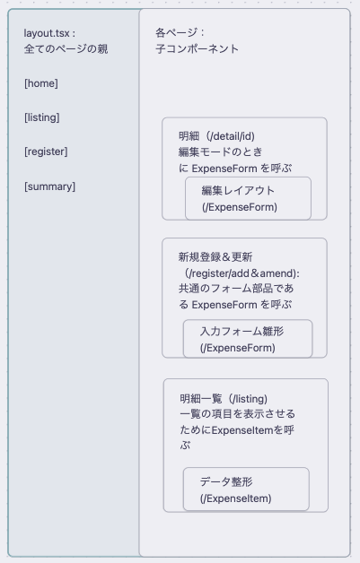

------------------------------ unfixed ------------------------------
# 家計簿アプリ「やさしい家計簿さん」
「やさしい家計簿さん」リポジトリへようこそ！


# アプリの概要
「やさしい家計簿さん」は以下の特徴を持つ家計簿アプリです。
・入出金明細登録機能
・明細の取得機能
・予算登録機能
・予算管理機能


# 現在のスタック
- **フロントエンド**: Next.js 14 (App Router) + TypeScript + MUI
- **データベース**: PostgreSQL (Prisma ORM)
- **テスト**: Vitest + React Testing Library + Playwright (E2E)


# 開発環境セットアップ


# 依存関係のインストール
```bash
# 依存関係のインストール
npm install

# 開発サーバーの起動
npm run dev

# テストの実行
npm test

# ビルド
npm run build -d
```


# 環境変数の設定

`.env`ファイルを作成し、以下の環境変数を設定してください：

```
env


```


# プロジェクト構造
```

```


# テストポリシー

## 基本ルール

+  コンポーネントのテストは、VitestとReact Testing Library(RTL)を用いて行う。
+  E2E（End-to-End）テストはPlaywrightを用いて、ユーザーの主要な操作フローをテストする。
+  テストカバレッジは、プロジェクト全体で80%以上を目標とする。詳細は後述の「カバレッジ目標」を参照。


## フェーズ別テスト戦略
#### 1. ユニットテスト (Vitest + RTL)
- **目的**: コンポーネントや関数が単体で正しく動作することを保証する。
- **対象**:
    - `components`ディレクトリ以下のUIコンポーネント（表示の確認、イベント発火など）
    - `lib`や`utils`ディレクトリ以下のビジネスロジックや純粋関数
- **実行タイミング**: `git push`時（CI/CDで自動実行）、またはローカルでの開発中。
- **実行時間**: 5分以内に完了することを目指す。

#### 2. E2Eテスト (Playwright)
- **目的**: ユーザーの操作シナリオを通して、複数のコンポーネントやページが連携して正しく機能することを保証する。
- **対象**:
    - ユーザー登録〜ログイン
    - 入出金明細の登録〜一覧表示
    - 予算の登録〜更新
- **実行タイミング**: developブランチへのマージ時や、本番デプロイ前（CI/CDで自動実行）。
- **タグ**: `@critical`（最重要機能）、`@smoke`（主要機能の簡易チェック）などのタグでテストを分類し、実行スコープを制御する。

### テスト環境

- **テストDB**: 
- **ブラウザ**: 
- **モック**: 

### E2E / MCP の動かし方
```

```


## 開発時のテストコード条件

| テストコードとPRの処理        | 対象（具体例）                                                                                                                                                                                     |
| ------------------- | ------------------------------------------------------------------------------------------------------------------------------------------------------------------------------------------- |
| 必ずテストコードを同梱         | ・**ロジックを含むサーバー/クライアントコンポーネント**の追加・変更  <br>・**フォームやインタラクティブな要素を持つコンポーネント** (`BudgetForm.tsx`など)<br>・**API Route Handlers (`route.ts`) や Server Actions**の追加・変更  <br>・バグ修正（再発防止のためのテストコードを追加） |
| あることが望ましいが、βまでは省略可能 | ・**静的な表示が中心のコンポーネント**（ヘッダー、フッターなど）  <br>・E2Eテストのシナリオ拡充（既存機能の別パターンのテストなど）2Eテストのシナリオ追加                                                                                                        |
| 省略可能                | ・テキストやスタイルの軽微な修正  <br>・ドキュメントの修正（READMEなど）  <br>・リファクタリング（既存テストが通ることが前提）<br>                                                                                                                |
|                     |                                                                                                                                                                                             |


## カバレッジ目標
テストで重点的に守りたい箇所を、App Routerの構造に合わせて具体的にします。
- **目標**: プロジェクト全体で**80%**を目標とする。
- **重点領域 (90%以上を目指す)**:
    - **`components`ディレクトリ内の主要コンポーネント**:
        - 特に状態（`useState`）やユーザーインタラクション（`onClick`, `onChange`など）を持つクライアントコンポーネント。
        - 例： `BudgetForm.tsx`, `SummaryChart.tsx`
            
    - **Server Actions / Route Handlers (`route.ts`)**:
        - データベースへの書き込みや外部API連携など、副作用を伴う重要なビジネスロジック。
            
    - **E2Eテストによる主要シナリオの網羅**:
        - ユーザーが行う一連の操作（例: ログイン → 予算登録 → 一覧で確認）が、正常に完了することをPlaywrightで保証する。



